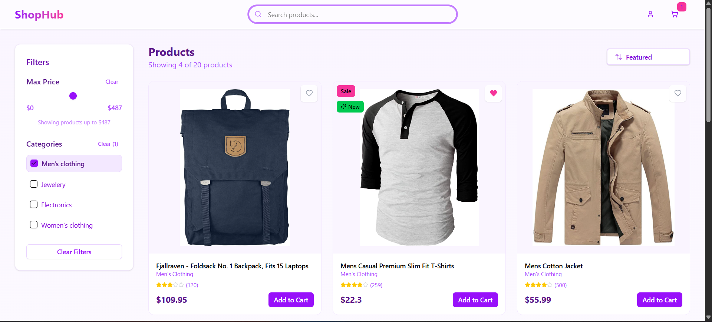
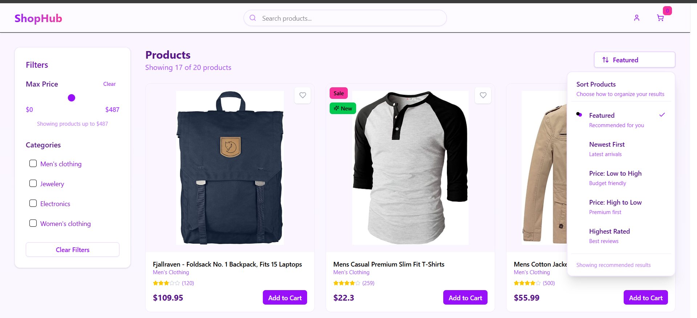
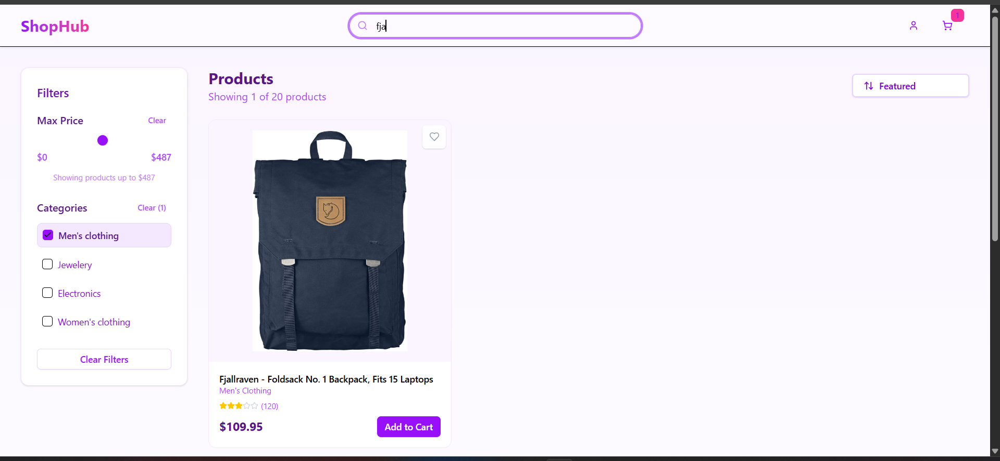
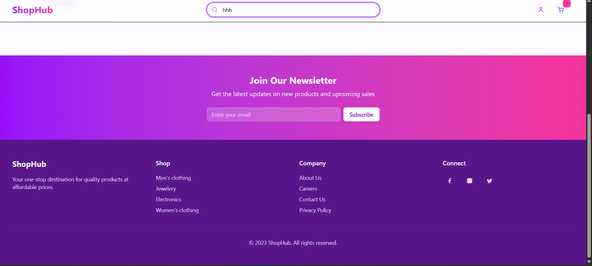
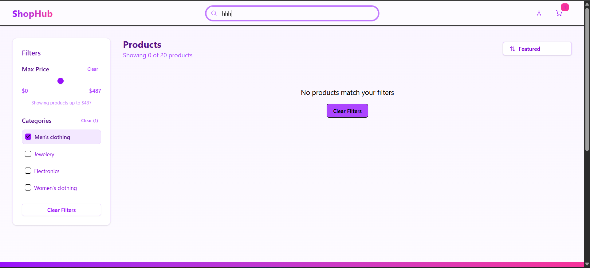

# 🛍️ Products Catalog – React App

## 📖 Overview

**Products Catalog** is a sleek, responsive e-commerce frontend built with **React**, allowing users to browse, filter, sort, and favorite products from an external API. Featuring a modern UI and smooth interactions, the app is styled with **Tailwind CSS** and enhanced with **ShadCN UI** components.

---

## ✨ Features

- ✅ Browse a variety of products
- 🔍 **Search** products by keyword
- 🎯 **Filter** by category
- 💰 **Sort** by price, rating, or newest
- 💖 Mark/unmark products as **favorites**
- 🧑‍🎨 Smooth UI with scroll effects and hover animations
- 📱 Fully responsive design

---

## ⚙️ Tech Stack

- ⚛️ **React**
- 📦 **Axios** – for fetching products
- 🎨 **Tailwind CSS** – utility-first styling
- 🧩 **ShadCN/UI** – Sliders, Checkboxes, Dropdowns, etc.
- 🎯 **Lucide Icons** – modern icon set

---

| 🏠 Home View                    | 🔍 Filters & Sorting                  |
| ------------------------------- | ------------------------------------- |
|  |  |

 SearchFilter View                 |
|------------------------------------- |
  |

|  Footer View                    |  Noproduct filtred View                 |
| ------------------------------- | ------------------------------------- |
|  |  |

## 🚀 Getting Started

### Prerequisites

- Node.js (v14 or higher)
- npm or yarn
- Git

### Installation

```bash
git clone https://github.com/your-username/products-catalog.git
cd products-catalog
npm install
npm run dev
